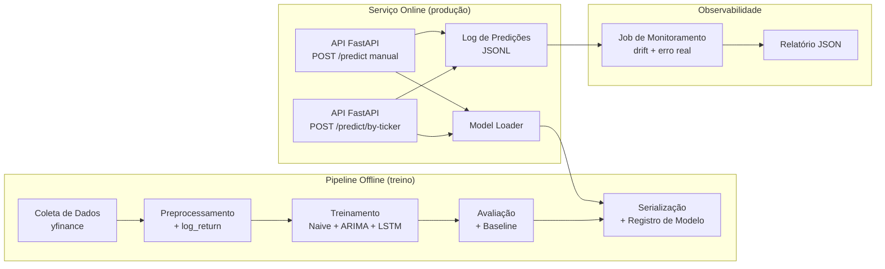

# Previsão de Cotação de Ações — PETR4.SA (MLOps)

Projeto da Fase 5 (Machine Learning Engineering) do curso: um pipeline completo de MLOps para
prever o preço de fechamento do próximo pregão de uma ação, com modelo servido via API REST,
monitoramento de produção e deploy em container.

## 1. Empresa/ticker escolhido

**PETR4.SA** (Petrobras, ação preferencial, B3). Critérios: alta liquidez, histórico diário longo
e contínuo (2015–hoje) sem lacunas relevantes de pregão, e volatilidade suficiente para tornar o
problema não trivial. O ticker é 100% configurável via `config.yaml`/`.env` (`TICKER=...`) —
qualquer símbolo do Yahoo Finance funciona sem alterar código.

## 2. Algoritmo escolhido

Três modelos são treinados e comparados no mesmo protocolo de avaliação (one-step-ahead):

| Modelo | Papel |
|---|---|
| Naive (`Close(t+1) = Close(t)`) | Baseline ingênuo — piso de comparação |
| ARIMA (via `pmdarima.auto_arima`) | Baseline estatístico |
| **LSTM** (rede recorrente, `tensorflow.keras`) | **Modelo de produção**, servido pela API |

O LSTM prevê **retorno logarítmico** diário (`log(Close_t / Close_{t-1})`), não o preço absoluto
— ver seção 9 (Limitações) para o porquê.

## 3. Arquitetura



Documentação técnica completa e minuciosa de cada etapa em [docs/](docs/00-indice.md).

## 4. Como rodar localmente

### 4.1 Ambiente

```powershell
python -m venv .venv
.venv\Scripts\Activate.ps1
pip install --upgrade pip
pip install -r requirements.txt
copy .env.example .env
```

### 4.2 Pipeline de dados e treino (nessa ordem)

```powershell
python -m src.data_collection.run_collection      # data/raw/PETR4.SA.csv
python -m src.preprocessing.run_preprocessing      # data/processed/*.parquet + scaler.joblib
python -m src.training.run_training                # treina, avalia, serializa e promove o modelo
```

Ao final, `models/metadata/evaluation_report.json` mostra a comparação dos 3 modelos e
`models/artifacts/` contém o modelo serializado (só é gravado se o LSTM passar no gate de
aceite — ver seção 5).

### 4.3 Rodar a API

```powershell
uvicorn api.main:app --reload
```

Ou via Docker (mesma imagem usada em produção):

```powershell
docker compose up --build
```

Acesse `http://localhost:8000/docs` para a documentação interativa (Swagger).

### 4.4 Testes automatizados

```powershell
pytest tests/ -v
```

## 5. Resultados do modelo

Avaliação one-step-ahead sobre o conjunto de teste (430 pregões, 2024-10-23 a 2026-07-17):

| Modelo | MAE | RMSE | MAPE |
|---|---|---|---|
| Naive (baseline) | 0.389 | 0.551 | 1.14% |
| ARIMA | 0.387 | 0.549 | 1.13% |
| **LSTM (produção)** | 0.402 | 0.555 | **1.18%** |

Critério de aceite: MAPE de teste ≤ 5% (hard gate) — **passou** (1,18%). O LSTM não supera o
baseline naive/ARIMA neste caso (soft gate, não bloqueia — ver seção 9), mas fica no mesmo
patamar de erro, validando que o modelo aprendeu um comportamento coerente com a dinâmica real da
série, sem overfitting nem extrapolação.

## 6. Documentação da API

Documentação interativa completa (OpenAPI/Swagger) em `/docs` assim que a API estiver no ar.

```bash
# Fluxo principal — a API busca e extrai os dados sozinha a partir do ticker
curl -X POST http://localhost:8000/predict/by-ticker \
  -H "Content-Type: application/json" \
  -d '{"ticker": "PETR4.SA"}'

# Health check
curl http://localhost:8000/health
```

Especificação completa de endpoints, schemas e códigos de erro em
[docs/08-api-especificacao.md](docs/08-api-especificacao.md).

## 7. Link da API em produção

`TODO: preencher após o deploy (Render/Railway/HF Spaces) — ver docs/09-deploy-mlops.md`

## 8. Estratégia de monitoramento

Cada predição é logada em `monitoring/logs/predictions.jsonl`. O job
`python -m src.monitoring.run_monitoring` compara, para predições cuja data já passou, o valor
previsto contra o fechamento real (buscado via yfinance), calcula MAE/MAPE de produção, e checa
drift de entrada (z-score da média recente dos preços recebidos vs. estatísticas do treino),
gravando `monitoring/reports/monitoring_report_{data}.json`. Detalhes completos em
[docs/10-monitoramento-observabilidade.md](docs/10-monitoramento-observabilidade.md).

## 9. Limitações conhecidas e próximos passos

- **Correção de metodologia feita durante a implementação:** a especificação inicial normalizava
  o `Close` absoluto com `MinMaxScaler` ajustado só no treino. Como PETR4.SA valorizou ~17x entre
  2015 (início do treino) e 2026 (período de teste), o scaler ficava com faixa incompatível com o
  preço de teste, e o LSTM extrapolava mal (MAPE de teste ~5-6%, pior que o naive). A correção —
  prever retorno logarítmico em vez de preço absoluto — resolveu o problema (MAPE caiu para
  1,18%). Ver [docs/03-preprocessamento-eda.md](docs/03-preprocessamento-eda.md) seção 4.
- **Superar o baseline naive é notoriamente difícil** para previsão de ponto de um passo à frente
  em preço de fechamento diário de ações líquidas (mercado fracamente eficiente). Por isso esse
  critério é um soft gate (aviso, não bloqueio) — ver
  [docs/05-avaliacao-metricas.md](docs/05-avaliacao-metricas.md) seção 4.
- `prediction_for_date` não considera feriados de bolsa, apenas fins de semana.
- Sem re-treino automático nem rollback automático por métrica — ambos são operações manuais
  documentadas em [docs/09-deploy-mlops.md](docs/09-deploy-mlops.md).

## 10. Vídeo de apresentação

`TODO: preencher com o link do vídeo (5+ min) explicando a estratégia de MLOps empregada`

## Documentação técnica completa

Especificação minuciosa de cada etapa (contratos de função, schemas, decisões de arquitetura) em
[docs/00-indice.md](docs/00-indice.md).
