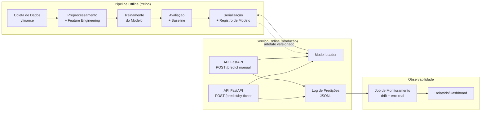

# 01 — Arquitetura Geral

## 1. Objetivo do sistema

Prever o preço de fechamento (`Close`) do próximo pregão de uma ação listada em bolsa, expor essa
previsão via API REST, e manter observabilidade sobre o desempenho do modelo em produção.

## 2. Visão de componentes

Esta separação é deliberada e espelha uma arquitetura em camadas (análogo a Domain/Application/
Infrastructure em .NET):

| Camada | Responsabilidade | Não faz |
|---|---|---|
| Coleta de Dados | Buscar e persistir dados brutos (imutáveis) | Não limpa, não normaliza |
| Preprocessamento | Limpar, criar features, dividir treino/teste | Não treina modelo |
| Treinamento | Ajustar hiperparâmetros, treinar, produzir modelo em memória | Não decide se o modelo "é bom o suficiente" |
| Avaliação | Calcular métricas, comparar com baseline, aprovar/reprovar o artefato | Não serializa |
| Serialização | Persistir modelo + metadados de forma versionada | Não sabe como o modelo foi treinado |
| API | Carregar modelo aprovado, validar entrada, responder predição, logar | Não treina, não recalcula features de negócio complexas fora do contrato |
| Monitoramento | Ler logs, calcular drift/erro, alertar | Não re-treina automaticamente (fora de escopo deste desafio) |

## 3. Decisões de arquitetura (ADRs resumidas)

### ADR-01: Empresa e ticker configuráveis, não hardcoded
**Decisão:** o ticker é um parâmetro de configuração (`TICKER` em `.env` / `config.yaml`), nunca
uma string fixa espalhada pelo código.
**Motivo:** permite trocar a empresa sem alterar código-fonte, e é exigido pelo próprio enunciado
("escolha uma empresa à sua escolha").
**Valor sugerido:** `PETR4.SA` (Petrobras, alta liquidez, histórico longo, sem lacunas de pregão
relevantes). Qualquer ticker do Yahoo Finance funciona sem alteração de código.

### ADR-02: Modelo — LSTM (rede recorrente) como principal, com baseline ARIMA
**Decisão:** implementar **LSTM univariado** (janela deslizante de preços) como modelo principal
de produção, e um **ARIMA/SARIMAX** como baseline estatístico comparativo (obrigatório para a
métrica de avaliação, ver [05-avaliacao-metricas.md](05-avaliacao-metricas.md)).
**Motivo:** o enunciado aceita ARIMA, Prophet ou LSTM. LSTM captura não-linearidades e é o que
melhor demonstra domínio de deep learning em série temporal para fins de avaliação acadêmica: além
disso, ter dois modelos (estatístico vs. neural) fortalece a seção de avaliação comparativa do
projeto e do vídeo de apresentação.
**Alternativa descartada:** Prophet sozinho — mais simples de implementar, mas demonstra menos
profundidade técnica.

### ADR-03: API stateless, modelo carregado em memória no startup
**Decisão:** a API não re-treina nem acessa a internet em tempo de requisição. Ela carrega o
artefato serializado uma vez, no evento de *startup*, e mantém em memória.
**Motivo:** latência previsível, sem dependência de rede externa (yfinance) no caminho crítico de
produção.

### ADR-04: Logging de predições em JSONL local (não banco de dados)
**Decisão:** cada requisição/resposta da API é logada como uma linha JSON em
`monitoring/logs/predictions.jsonl`.
**Motivo:** simplicidade suficiente para o escopo do desafio, sem exigir infraestrutura de banco de
dados adicional no deploy gratuito. Ver [10-monitoramento-observabilidade.md](10-monitoramento-observabilidade.md)
para o schema completo e trilha de migração para um banco real, se necessário no futuro.

### ADR-05: Deploy via container (Docker) em plataforma gratuita
**Decisão:** empacotar a API em uma imagem Docker e publicar em Render, Railway ou Hugging Face
Spaces (Docker runtime).
**Motivo:** portabilidade total, mesma imagem roda local e em produção — elimina "funciona na
minha máquina". Ver [09-deploy-mlops.md](09-deploy-mlops.md).

## 4. Fluxo de dados ponta a ponta

1. Script offline baixa histórico diário do ticker configurado → `data/raw/{ticker}.csv`.
2. Script de preprocessamento lê o raw, limpa, gera features, faz split temporal → `data/processed/`.
3. Script de treinamento lê `data/processed/train.parquet`, treina LSTM e ARIMA → objetos em memória.
4. Script de avaliação testa ambos em `data/processed/test.parquet`, gera `models/metadata/evaluation_report.json`.
5. Se LSTM atende ao critério de aceite (ver doc 05), script de serialização grava:
   - `models/artifacts/lstm_model.keras`
   - `models/artifacts/scaler.joblib`
   - `models/metadata/model_metadata.json`
6. API, no startup, carrega os 3 artefatos acima.
7. Requisição chega por um dos dois endpoints (doc 08):
   - `POST /predict/by-ticker` (fluxo principal): API recebe só o ticker, **ela mesma busca**
     o histórico recente via yfinance e monta a janela de entrada.
   - `POST /predict` (modo manual/teste): cliente já envia a janela de preços pronta.
   Em ambos os casos, a partir da janela montada: aplica `scaler` → roda inferência LSTM →
   desfaz a normalização → responde → loga em JSONL.
8. Job de monitoramento (executado manualmente ou agendado) lê o JSONL, compara predições passadas
   com o fechamento real (quando já disponível), calcula métricas de erro em produção e drift de
   entrada.

## 5. Requisitos não-funcionais

| Requisito | Meta |
|---|---|
| Tempo de resposta da API (`/predict`) | < 500 ms (modelo já em memória, sem chamada de rede) |
| Disponibilidade do endpoint de health check | `GET /health` sempre implementado (obrigatório para deploy) |
| Reprodutibilidade do treino | Seed fixa (`random_state=42`) em todos os componentes estocásticos |
| Rastreabilidade do modelo em produção | Toda resposta da API inclui `model_version` |

## 6. Referência cruzada

Este documento é a "visão de 10.000 pés". Cada camada tem seu próprio documento com o contrato de
implementação detalhado — comece por [12-configuracao.md](12-configuracao.md).
